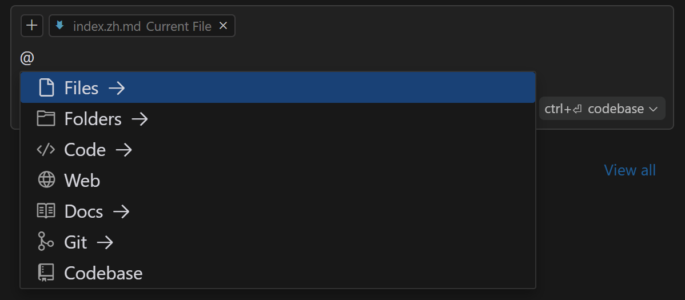

# 为什么是 Cursor？

Cursor 正在改变我们的工作方式，为开发者、产品经理和编程初学者创造了前所未有的机遇。它通过 AI 技术提高编码效率，降低入门门槛，同时改善代码质量并加速创新。

## 编程的未来

特斯拉 CEO 埃隆·马斯克曾预言："未来，编程语言将消失。我们将直接用自然语言与计算机交流。"这个未来，或许比我们想象的更近。

回顾编程的历史，我们可以看到一个明显的趋势：编程正在变得越来越简单，越来越平民化。在计算机的早期，只有少数精英才能进行编程，他们大多是火箭工程师或计算机科学家。随着高级编程语言的出现，各种框架和 IDE 的发展，我们构建了大量的数字基础设施，使得即使没有科班出身的人也能进行编程。

编程的本质是为了解决问题，为了创造。我们编写代码不是为了编码本身，而是为了实现想法，构建解决方案。现在，我们正站在自然语言编程的时代门槛。AI 编程工具的出现，正在进一步降低编程的门槛，使得"人人都是产品经理，人人皆可创造"成为可能。

学习 Cursor，就是在适应未来。我们先从 Cursor 的核心优势开始吧。

## Cursor 核心优势

Cursor 是基于 VsCode 开发的编辑器，而其他编程工具大多基于 VsCode 的插件。这是它与众不同的起点。因此它才能创造性地打造了人机高效协作的编程环境。

总结起来，Cursor 的核心优势有：

### 自然语言编程

Cursor 在自然语言编程方面具有显著优势，真正实现了"动动嘴就能编程"的愿景：

1. **直观的交互式编程**：通过 Chat 界面，用户可以用自然语言描述需求，Cursor 能够理解并转化为代码。用户可以通过对话方式逐步完善需求，Cursor 会相应地调整和优化代码，使编程过程更加灵活和高效。

2. **上下文感知和多语言支持**：Cursor 能够理解项目的整体结构和上下文，使得自然语言指令更加精准。它支持多种编程语言，能根据项目需求自动选择合适的语言生成代码，并可以引用特定文件或代码段进行更精确的操作。

3. **代码解释和持续学习**：除了生成代码，Cursor 还能解释代码的功能和原理，这对于学习编程或理解复杂代码非常有帮助。通过与用户的持续交互，Cursor 能够学习和适应用户的编程风格和偏好，提供越来越个性化的编程体验。

这些优势不仅提高了编程效率，还大大降低了编程的门槛，使得"人人都能编程"的理想更加接近现实。无论是经验丰富的开发者还是编程新手，都能从 Cursor 的自然语言编程能力中受益，实现更快速、更直观的代码开发过程。

### 代码编辑

AI 可以代码生成，Cursor 还提供了多种强大的代码编辑功能，大大提升了编程效率：

#### 1. Tab 键自动补全

Cursor Tab 是一个强大的原生自动补全功能，比传统的代码补全更进一步：

- 可以建议光标周围的编辑，而不仅仅是插入额外的代码。
- 能够同时修改多行代码。
- 基于您最近的更改和 linter 错误提供建议。

使用方法：
- 接受建议：按 `Tab` 键
- 拒绝建议：按 `Esc` 键或继续输入
- 部分接受：按 `Ctrl/⌘ →` 逐词接受

#### 2. Cmd K 内联编辑

通过 `Cmd K`（在 Windows/Linux 上是 `Ctrl K`），您可以在编辑器窗口中生成新代码或编辑现有代码：

- 选择代码后使用 `Cmd K`，可以进行智能修改。
- 不选择代码直接使用 `Cmd K`，可以生成新代码。
- 支持多行编辑和内联生成。
- 可以通过追加指令进一步优化生成结果。

#### 3. Chat 界面

通过 Chat 界面，您可以：

- 智能修改现有代码
- 进行多行编辑
- 引导 AI 修改代码
- 使用 `@` 符号引用上下文信息

#### 4. Composer 功能

Composer 是 Cursor 的一个强大的实验性功能，它将 AI 辅助编程提升到了一个新的水平：

- **多文件编辑**：Composer 允许您同时创建和编辑多个文件，极大地提高了处理复杂项目的效率。

- **全应用生成**：通过简单的自然语言指令，Composer 可以生成整个应用程序的框架，包括多个文件和完整的项目结构。

- **交互式开发**：您可以通过对话方式逐步完善和修改生成的代码，Composer 会根据您的指示进行调整。

- **上下文理解**：Composer 能够理解整个项目的结构和上下文，使得生成的代码更加符合项目需求。

使用方法：
- 启用 Composer：在 Cursor 设置中的 Beta 部分激活 Composer。
- 打开 Composer：使用快捷键 `Cmd+I`（Mac）或 `Ctrl+I`（Windows/Linux）。
- 全屏模式：使用 `Cmd+Shift+I`（Mac）或 `Ctrl+Shift+I`（Windows/Linux）打开全屏三面板模式。

Composer 特别适合快速原型开发、复杂功能实现和项目重构等场景，能显著提高开发效率。

#### 5. 终端 Cmd K

在 Cursor 内置终端中，您可以使用 `Cmd K`（Windows/Linux 上是 `Ctrl K`）来：

- 打开终端底部的提示栏
- 描述所需的终端操作
- 生成相应的命令
- 使用 `Esc` 接受命令，或 `Cmd/Ctrl + Enter` 立即运行命令

这些功能共同构成了 Cursor 强大的代码修改能力，使编程过程更加高效和智能化。无论是编写新代码还是修改现有代码，Cursor 都能提供有力的支持。

### 上下文引用能力

Cursor 提供了强大的上下文引用能力。

**代码片段**：编辑器里面任意代码块，都可以悬浮菜单、或者 `Cmd/Ctrl + L` 快速添加到 `Chat` 界面。复制粘贴到 ChatGPT 的时代已经过去，现在你可以直接引用代码。

**@ 引用** : 用户可以使用 @符号快速访问相关上下文，还可以通过全局代码检索高效搜索整个项目的代码。

- 引用文件
- 引用文件夹
- 引用 URL

### 多模型支持

Cursor 的一个关键优势是其多模型支持策略，这使得它在快速发展的 AI 领域中始终保持竞争力。

- **灵活性**：Cursor 不局限于单一 AI 模型，而是可以集成多种先进的语言模型。甚至，还可以集成自己的模型。

- **持续更新**：随着新模型的发布，Cursor 可以迅速整合，确保用户始终能使用最先进的 AI 技术。

- **适应性强**：不同任务可能需要不同的 AI 模型，多模型支持使 Cursor 能够为各种编程需求提供最佳解决方案。

特别值得一提的是，随着 Claude 3.5 Sonnet 等模型在编程能力上的突飞猛进，Cursor 能够迅速整合这些进步，这种灵活性确保了 Cursor 在 AI 辅助编程工具中始终保持领先地位。

## 下一步

Cursor 提供了高效、智能的编码环境，能显著提高编码速度，帮助开发者更好地理解和操作复杂的代码库。尽管 AI Coding 工具仍面临一些挑战，但它们有望显著提升甚至自动化工程工作，市场空间广阔。如果你想提升编码效率和质量，适应未来的工作方式，Cursor 值得一试。

[返回目录](../../../README.zh.md)